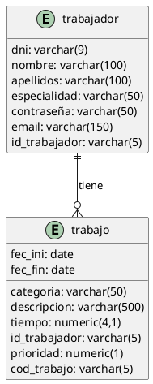

<!-- Links references -->

[MiguelColl]: https://github.com/MiguelColl

[LtVish]: https://github.com/LtVish

[DanielAlmazan]: https://github.com/DanielAlmazan

[Nest Hotel]: https://github.com/DanielAlmazan/hotel-nest

[TaskLynx Business]: https://github.com/DanielAlmazan/TaskLynx-JavaFX

[TaskLynx API]: https://github.com/DanielAlmazan/TaskLynx-SpringBoot

[TaskLynx Mobile]: https://github.com/DanielAlmazan/TaskLynx-Mobile

# API – Index

{width=300 border-effect="none"}

## Introduction

[TaskLynx API] is a REST API that allows communication between [TaskLynx Business] and [TaskLynx Mobile].

## Technologies

- Java 21
- Spring Boot 2.5.4
- Apache Maven 3.9.6
- PostgreSQL

## Entity-Relationship Diagram

## Class Diagram

```plantuml
@startuml

top to bottom direction
skinparam linetype ortho

interface ITrabajadorDAO << interface >> {
  + existsById(String): boolean
  + findByIdTrabajadorAndContraseña(String, String): Trabajador
  + existsByDni(String): boolean
  + findBySpeciality(String): List<Trabajador>
  + existsByEmail(String): boolean
}
interface ITrabajadorService << interface >> {
  + save(Trabajador): Trabajador
  + findById(String): Trabajador
  + existsByEmail(String): boolean
  + existsById(String): boolean
  + findAll(): List<Trabajador>
  + findByIdAndPass(String, String): Trabajador
  + existsByDni(String): boolean
  + delete(String): void
  + findBySpeciality(String): List<Trabajador>
}
interface ITrabajoDAO << interface >> {
  + findCompletaByTrabajador(String): List<Trabajo>
  + findPendingByTrabajadorOrderByPrioridad(String): List<Trabajo>
  + findTrabajadorByCodTrabajo(String): Trabajador
  + findByFecFinIsNotNull(): List<Trabajo>
  + findPendienteByTrabajador(String): List<Trabajo>
  + findByFecFinIsNull(): List<Trabajo>
  + findByIdTrabajadorIdTrabajadorAndFecFinIsLessThanEqual\
(String, LocalDate): List<Trabajo>
  + findByIdTrabajadorIsNull(): List<Trabajo>
  + findAllByFecFinIsNotNull(): List<Trabajo>
  + findAllByFecFinIsNull(): List<Trabajo>
  + findCompletadosPorTrabajadorEntreFechas\
(String, LocalDate, LocalDate): List<Trabajo>
  + findPendingByTrabajadorAndPrioridad\
(String, BigDecimal): List<Trabajo>
}
interface ITrabajoService << interface >> {
  + delete(String): void
  + asignarTrabajo(String, String): Trabajo
  + findAll(): List<Trabajo>
  + editarFechaFin(String, LocalDate): Trabajo
  + findPendientesPorTrabajadorOrderByPrioridadAsc\
(String): List<Trabajo>
  + findCompletadosPorTrabajadorHastaFecha\
(String, LocalDate): List<Trabajo>
  + findPendientesPorTrabajadorYPrioridad\
(String, BigDecimal): List<Trabajo>
  + findPendientesPorTrabajador(String): List<Trabajo>
  + findCompletados(): List<Trabajo>
  + findTrabajadorByCodTrabajo(String): Trabajador
  + findCompletadosPorTrabajador(String): List<Trabajo>
  + crearTrabajoConTrabajador(Trabajo, String): Trabajo
  + editarTiempo(String, BigDecimal): Trabajo
  + findPendientes(): List<Trabajo>
  + finalizarTrabajo(String, LocalDate, BigDecimal): Trabajo
  + findById(String): Trabajo
  + save(Trabajo): Trabajo
  + findCompletadosPorTrabajadorEntreFechas
(String, LocalDate, LocalDate): List<Trabajo>
  + findTrabajosSinTrabajador(): List<Trabajo>
}
class IndexController {
  + IndexController(): 
  + index(Model): String
}
class TaskLynxSpringBootApplication {
  + TaskLynxSpringBootApplication(): 
  + main(String[]): void
  ~ hiddenHttpMethodFilter(): HiddenHttpMethodFilter
}
class TaskLynxSpringBootApplicationTests {
  ~ TaskLynxSpringBootApplicationTests(): 
  ~ contextLoads(): void
}
class Trabajador {
  + Trabajador
(String, String, String, String, String, String, String): 
  + Trabajador(String, String, String, String, String, String): 
  + Trabajador(): 
  - idTrabajador: String
  - trabajos: Set<Trabajo>
  - apellidos: String
  - email: String
  - dni: String
  - especialidad: String
  - contraseña: String
  - nombre: String
  + getDni(): String
  + getEspecialidad(): String
  + setApellidos(String): void
  + setIdTrabajador(String): void
  + setEmail(String): void
  + getContraseña(): String
  + setEspecialidad(String): void
  + getApellidos(): String
  + setDni(String): void
  + setContraseña(String): void
  + setNombre(String): void
  + setTrabajos(Set<Trabajo>): void
  + toString(): String
  + getNombre(): String
  + getTrabajos(): Set<Trabajo>
  + getIdTrabajador(): String
  + getEmail(): String
}
class TrabajadorServices {
  + TrabajadorServices(): 
  ~ trabajadorDAO: ITrabajadorDAO
  + existsByDni(String): boolean
  + delete(String): void
  + findBySpeciality(String): List<Trabajador>
  + findByIdAndPass(String, String): Trabajador
  + existsByEmail(String): boolean
  + findAll(): List<Trabajador>
  + findById(String): Trabajador
  + save(Trabajador): Trabajador
  + existsById(String): boolean
}
class TrabajadoresController {
  + TrabajadoresController(): 
  - trabajoService: ITrabajoService
  - trabajadorService: ITrabajadorService
  + update(Trabajador, String, BindingResult): ResponseEntity<?>
  + indexAll(): ResponseEntity<?>
  + indexByEspecialidad(String): ResponseEntity<?>
  + indexOneTrabajosPendientesOrderByPrioridad
(String): ResponseEntity<?>
  + delete(String): ResponseEntity<?>
  + indexOneTrabajos(String): ResponseEntity<?>
  + indexOneByIdAndContraseña(String, String): ResponseEntity<?>
  + indexOne(String): ResponseEntity<?>
  + indexOneTrabajosCompletadosEntreFechas
(String, LocalDate, LocalDate): ResponseEntity<?>
  + indexOneTrabajosPendientes(String): ResponseEntity<?>
  + create(Trabajador, BindingResult): ResponseEntity<?>
  - showErrors
(BindingResult, Map<String, Object>, List<String>): boolean
  + indexOneTrabajosPendientesByPrioridad
(String, BigDecimal): ResponseEntity<?>
}
class TrabajadoresControllerIntegrationTest {
  + TrabajadoresControllerIntegrationTest(): 
  ~ URL: String
  - restTemplate: TestRestTemplate
  - newTrabajador: Trabajador
  + deleteShouldSucceed(): void
  + findAllShouldGetFour(): void
  + updateShouldSucceed(): void
  + updateShouldFail(): void
  + findByIdShouldFail(): void
  + findBySpecialityShouldGetOne(): void
  + findByIdSucceeds(): void
  + findAllShouldGetThree(): void
  + findByIdAndPassShouldFail(): void
  + createShouldSucceed(): void
  + createShouldFail(): void
}
class TrabajadoresViewController {
  + TrabajadoresViewController(): 
  - trabajoServices: TrabajoServices
  ~ trabajadorServices: TrabajadorServices
  + indexTrabajadores(Model): String
  + verTrabajador(Model, String): String
  + anyadirTrabajador(Model): String
  + create(Trabajador, BindingResult, Model): ModelAndView
  + edit(Trabajador, BindingResult, Model): ModelAndView
  + delete(String): ModelAndView
  + editarTrabajador(Model, String): String
  - dniDuplicated(Trabajador, ModelAndView, boolean): boolean
  - addAtributes(Model): void
  + processForm
(Trabajador, BindingResult, Model, String): ModelAndView
  - emailDuplicated(Trabajador, ModelAndView, boolean): boolean
}
class Trabajo {
  + Trabajo(): 
  - descripcion: String
  - fecIni: LocalDate
  - codTrabajo: String
  - idTrabajador: Trabajador
  - prioridad: BigDecimal
  - fecFin: LocalDate
  - tiempo: BigDecimal
  - categoria: String
  + getPrioridad(): BigDecimal
  + setFecIni(LocalDate): void
  + getIdTrabajador(): Trabajador
  + setCategoria(String): void
  + setFecFin(LocalDate): void
  + setPrioridad(BigDecimal): void
  + getFecIni(): LocalDate
  + setTiempo(BigDecimal): void
  + getCategoria(): String
  + setIdTrabajador(Trabajador): void
  + getCodTrabajo(): String
  + getTiempo(): BigDecimal
  + toString(): String
  + setDescripcion(String): void
  + setCodTrabajo(String): void
  + getDescripcion(): String
  + getFecFin(): LocalDate
}
class TrabajoController {
  + TrabajoController(): 
  - trabajoService: ITrabajoService
  + editarFechaFin(String, LocalDate): ResponseEntity<?>
  + showAll(): ResponseEntity<?>
  + showCompletados(): ResponseEntity<?>
  + update(Trabajo, String, BindingResult): ResponseEntity<?>
  + showById(String): ResponseEntity<?>
  + finalizarTrabajo(String, LocalDate, BigDecimal): ResponseEntity<?>
  + showPendientes(): ResponseEntity<?>
  + showSinTrabajador(): ResponseEntity<?>
  + create(Trabajo, BindingResult): ResponseEntity<?>
  + showTrabajadorByCodTrabajo(String): ResponseEntity<?>
  - checkErrors
(BindingResult, Map<String, Object>, List<String>): boolean
  + asignarTrabajo(String, String): ResponseEntity<?>
  + editarTiempo(String, BigDecimal): ResponseEntity<?>
  + delete(String): ResponseEntity<?>
}
class TrabajoServices {
  + TrabajoServices(): 
  ~ trabajoDAO: ITrabajoDAO
  ~ trabajadorDAO: ITrabajadorDAO
  + findById(String): Trabajo
  + findTrabajadorByCodTrabajo(String): Trabajador
  + findCompletadosPorTrabajadorHastaFecha
(String, LocalDate): List<Trabajo>
  + findAll(): List<Trabajo>
  + editarFechaFin(String, LocalDate): Trabajo
  + findPendientes(): List<Trabajo>
  + findCompletadosPorTrabajadorEntreFechas
(String, LocalDate, LocalDate): List<Trabajo>
  + save(Trabajo): Trabajo
  + findCompletadosPorTrabajador(String): List<Trabajo>
  + findPendientesPorTrabajador(String): List<Trabajo>
  + crearTrabajoConTrabajador(Trabajo, String): Trabajo
  - validateDate(Trabajo, LocalDate): LocalDate
  + findPendientesPorTrabajadorYPrioridad
(String, BigDecimal): List<Trabajo>
  + findCompletados(): List<Trabajo>
  + delete(String): void
  + asignarTrabajo(String, String): Trabajo
  + finalizarTrabajo(String, LocalDate, BigDecimal): Trabajo
  + editarTiempo(String, BigDecimal): Trabajo
  + findTrabajosSinTrabajador(): List<Trabajo>
  - validateTime(BigDecimal, BigDecimal): BigDecimal
  + findPendientesPorTrabajadorOrderByPrioridadAsc\
(String): List<Trabajo>
}
class TrabajoViewController {
  + TrabajoViewController(): 
  ~ trabajoServices: TrabajoServices
  ~ trabajadorServices: TrabajadorServices
  + nuevoTrabajo(Model): String
  + indexTrabajos(Model): String
  + editarTrabajo(Model, String): String
  - editTrabajo(Trabajo, BindingResult): ModelAndView
  + delete(String): ModelAndView
  + processForm(Trabajo, BindingResult, String): ModelAndView
  + verTrabajo(Model, String): String
  - createTrabajo(Trabajo, BindingResult): ModelAndView
}

Trabajador                            "1" *-[#595959,plain]-> \
"trabajos\n*" Trabajo                               
TrabajadorServices                    "1" *-[#595959,plain]-> \
"trabajadorDAO\n1" ITrabajadorDAO                        
TrabajadorServices                     -[#008200,dashed]-^  \
ITrabajadorService                    
TrabajadoresController                "1" *-[#595959,plain]-> \
"trabajadorService\n1" ITrabajadorService                    
TrabajadoresController                "1" *-[#595959,plain]-> \
"trabajoService\n1" ITrabajoService                       
TrabajadoresControllerIntegrationTest "1" *-[#595959,plain]-> \
"newTrabajador\n1" Trabajador                            
TrabajadoresViewController            "1" *-[#595959,plain]-> \
"trabajadorServices\n1" TrabajadorServices                    
TrabajadoresViewController            "1" *-[#595959,plain]-> \
"trabajoServices\n1" TrabajoServices                       
Trabajo                               "1" *-[#595959,plain]-> \
"idTrabajador\n1" Trabajador                            
TrabajoController                     "1" *-[#595959,plain]-> \
"trabajoService\n1" ITrabajoService                       
TrabajoServices                       "1" *-[#595959,plain]-> \
"trabajadorDAO\n1" ITrabajadorDAO                        
TrabajoServices                       "1" *-[#595959,plain]-> \
"trabajoDAO\n1" ITrabajoDAO                           
TrabajoServices                        -[#008200,dashed]-^  \
ITrabajoService                       
TrabajoViewController                 "1" *-[#595959,plain]-> \
"trabajadorServices\n1" TrabajadorServices                    
TrabajoViewController                 "1" *-[#595959,plain]-> \
"trabajoServices\n1" TrabajoServices                       
@enduml
```

## Authors

### TRABAJADOR CRUD:

{width=80 border-effect="none"}

[Aitor Moreno Iborra][LtVish]

### TRABAJO CRUD:

{width=80 border-effect="none"}

[Miguel Collado][MiguelColl]

### API Development:

{width=80 border-effect="none"}

[Daniel Enrique Almazán Sellés][DanielAlmazan]
