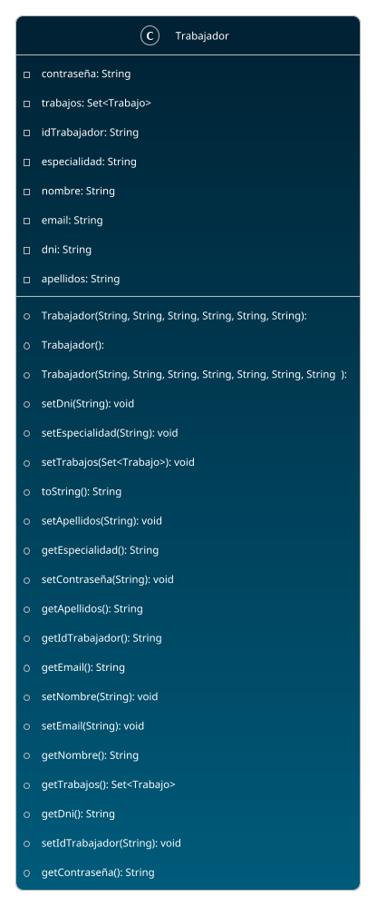

# Trabajador

## Model

## GET /api/trabajadores
> Returns all the workers in the database.  
> If there are no workers, it will return an empty list.

<tabs>
    <tab title="Successful response">
        <code-block lang="json">
            {
              "result": [
                {
                  "idTrabajador": "T003",
                  "dni": "34567890C",
                  "nombre": "Carlos",
                  "apellidos": "Martínez",
                  "especialidad": "Electricidad",
                  "contraseña": "contraseña3",
                  "email": "carlos.martinez@example.com"
                },
                {
                  "idTrabajador": "T001",
                  "dni": "12345678A",
                  "nombre": "Juan",
                  "apellidos": "Pérez",
                  "especialidad": "Carpintería",
                  "contraseña": "contraseña1",
                  "email": "juan.perez@example.com"
                }
              ],
              "error": false
            }
        </code-block>
    </tab>
    <tab title="Empty list response">
        <code-block lang="json">
            {
              "result": [],
              "error": false
            }
        </code-block>
    </tab>
</tabs>

***

## GET /api/trabajadores/:id
> Returns a worker by its ID.  
> If the worker does not exist, it will return an error message.

<tabs>
    <tab title="Successful response">
        <tip>
            /api/trabajadores/T003
        </tip>
         
        <code-block lang="json">
            {
              "result": {
                "idTrabajador": "T003",
                "dni": "34567890C",
                "nombre": "Carlos",
                "apellidos": "Martínez",
                "especialidad": "Electricidad",
                "contraseña": "contraseña3",
                "email": "carlos.martinez@example.com"
              },
              "error": false
            }
        </code-block>
    </tab>
    <tab title="Non-existent worker response">
        <tip>
            /api/trabajadores/asdtg
        </tip>
         
        <code-block lang="json">
            {
              "errorMessage": "El trabajador con ID: 'asdtg' no existe en la base de datos",
              "error": true
            }
        </code-block>
    </tab>
</tabs>
***

## POST /api/trabajadores
> Create a new worker in the database. Returns the worker created.  
> If there are any errors, it will return an error message with the list of errors.  
> If the worker already exists, it will return an error message.  
>   
> All the fields are required.  
> ID, DNI and email are unique fields.

<tabs>
    <tab title="Successful body">
        <code-block lang="json">
            {
              "idTrabajador": "T001",
              "dni": "12345678A",
              "nombre": "Pepe",
              "apellidos": "García",
              "especialidad": "Fontanería",
              "contraseña": "123",
              "email": "wefwefewf@ergerg.com"
            }
        </code-block>
    </tab>
    <tab title="Response">
        <code-block lang="json">
            {
              "result": {
                "idTrabajador": "T001",
                "dni": "12345678A",
                "nombre": "Pepe",
                "apellidos": "García",
                "especialidad": "Fontanería",
                "contraseña": "123",
                "email": "wefwefewf@ergerg.com"
              },
              "error": false
            }
        </code-block>
    </tab>
</tabs>

<tabs>
    <tab title="Error body">
        <code-block lang="json">
            {
              "idTrabajador": "T001",
              "dni": "",
              "nombre": "Pepe",
              "apellidos": "García",
              "especialidad": "Fontanería",
              "contraseña": "123",
              "email": "holaHolita"
            }
        </code-block>
    </tab>
    <tab title="Error response">
        <code-block lang="json">
            {
              "errorsList": [
                "El campo DNI no puede estar vacío",
                "El email no es válido"
              ],
              "error": true
            }
        </code-block>
    </tab>
</tabs>

<tabs>
    <tab title="Existent worker body">
        <code-block lang="json">
            {
              "idTrabajador": "T001",
              "dni": "12312312T",
              "nombre": "Pepe",
              "apellidos": "García",
              "especialidad": "Fontanería",
              "contraseña": "123",
              "email": "pepe@garcia.com"
            }
        </code-block>
    </tab>
    <tab title="Existent worker response">
        <code-block lang="json">
            {
              "errorsList": [
                    "Ya existe un trabajador con el ID: T001"
                ],
              "error": true
            }
        </code-block>
    </tab>
</tabs>

***

## PUT /api/trabajadores/:id
> Update a worker by its ID. Returns the worker updated.  
> If the worker does not exist, it will return an error message.  
> If any of the fields are empty or invalid, it will return an error message with the list of errors.

<tabs>
    <tab title="Successful body">
        <tip>
            /api/trabajadores/T001
        </tip>
         
        <code-block lang="json">
            {
                "idTrabajador": "T001",
                "dni": "12345678A",
                "nombre": "Pepe",
                "apellidos": "Gomez",
                "especialidad": "Fontanería",
                "contraseña": "123",
                "email": "wefwefewf@ergerg.com"
            }
        </code-block>
    </tab>
    <tab title="Response">
        <code-block lang="json">
            {
              "result": {
                "idTrabajador": "T001",
                "dni": "12345678A",
                "nombre": "Pepe",
                "apellidos": "Gomez",
                "especialidad": "Fontanería",
                "contraseña": "123",
                "email": "wefwefewf@ergerg.com"
              },
              "error": false
            }
        </code-block>
    </tab>
</tabs>

<tabs>
    <tab title="Error body">
        <tip>
            /api/trabajadores/T001
        </tip>
         
        <code-block lang="json">
            {
              "idTrabajador": "T001",
              "dni": "",
              "nombre": "Pepe",
              "apellidos": "García",
              "especialidad": "Fontanería",
              "contraseña": "123",
              "email": "holaHolita"
            }
        </code-block>
    </tab>
    <tab title="Error response">
        <code-block lang="json">
            {
              "errorsList": [
                "El campo DNI no puede estar vacío",
                "El email no es válido"
              ],
              "error": true
            }
        </code-block>
    </tab>
</tabs>

<tabs>
    <tab title="Non-existent worker body">
        <tip>
            /api/trabajadores/T999
        </tip>
         
        <code-block lang="json">
            {
                "idTrabajador": "T999",
                "dni": "12344321T",
                "nombre": "José",
                "apellidos": "Jimenez",
                "especialidad": "Ebanistería",
                "contraseña": "123",
                "email": "jose@jimenez.com"
            }
        </code-block>
    </tab>
    <tab title="Non-existent worker response">
        <code-block lang="json">
            {
              "errorsList": [
                "No se pudo editar, el trabajador con ID 'T999' no existe en la base de datos"
              ],
              "error": true
            }
        </code-block>
    </tab>
</tabs>

***

## DELETE /api/trabajadores/:id
> Delete a worker by its ID. Returns a response without errors.  
> If the worker does not exist, it will return an error message.

<tabs>
    <tab title="Successfull response">
        <tip>
            /api/trabajos/T001
        </tip>
         
        <code-block lang="json">
            {
              "error": false
            }
        </code-block>
    </tab>
    <tab title="Non-existent worker response">
        <tip>
            /api/trabajos/T999
        </tip>
         
        <code-block lang="json">
            {
              "errorMessage": "El trabajador con ID 'T999' no existe en la base de datos",
              "error": true
            }
        </code-block>
    </tab>
</tabs>
