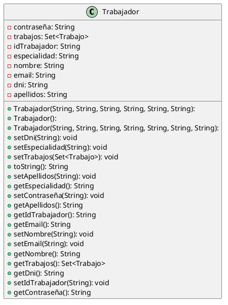

# Trabajador

## Model

## GET /api/trabajadores

> Returns all the workers in the database.  
> If there are no workers, it will return an empty list.

<tabs>
    <tab title="Successful response">
        <code-block lang="json">
            {
              "result": [
                {
                  "idTrabajador": "T003",
                  "dni": "34567890C",
                  "nombre": "Carlos",
                  "apellidos": "Martínez",
                  "especialidad": "Electricidad",
                  "contraseña": "contraseña3",
                  "email": "carlos.martinez@example.com"
                },
                {
                  "idTrabajador": "T001",
                  "dni": "12345678A",
                  "nombre": "Juan",
                  "apellidos": "Pérez",
                  "especialidad": "Carpintería",
                  "contraseña": "contraseña1",
                  "email": "juan.perez@example.com"
                }
              ],
              "error": false
            }
        </code-block>
    </tab>
    <tab title="Empty list response">
        <code-block lang="json">
            {
              "result": [],
              "error": false
            }
        </code-block>
    </tab>
</tabs>

***

## GET /api/trabajadores/:id

> Returns a worker by its ID.  
> If the worker does not exist, it will return an error message.

<tabs>
    <tab title="Successful response">
        <tip>
            /api/trabajadores/T003
        </tip>
         
        <code-block lang="json">
            {
              "result": {
                "idTrabajador": "T003",
                "dni": "34567890C",
                "nombre": "Carlos",
                "apellidos": "Martínez",
                "especialidad": "Electricidad",
                "contraseña": "contraseña3",
                "email": "carlos.martinez@example.com"
              },
              "error": false
            }
        </code-block>
    </tab>
    <tab title="Non-existent worker response">
        <tip>
            /api/trabajadores/asdtg
        </tip>
         
        <code-block lang="json">
            {
              "errorMessage": "El trabajador con ID: 'asdtg' no existe en la base de datos",
              "error": true
            }
        </code-block>
    </tab>
</tabs>

***

## POST /api/trabajadores

> Create a new worker in the database. Returns the worker created.  
> If there are any errors, it will return an error message with the list of errors.  
> If the worker already exists, it will return an error message.
>
> All the fields are required.  
> ID, DNI and email are unique fields.

<tabs>
    <tab title="Successful body">
        <code-block lang="http request">
            POST /api/trabajadores
            Content-Type: application/json
            {
              "idTrabajador": "T001",
              "dni": "12345678A",
              "nombre": "Pepe",
              "apellidos": "García",
              "especialidad": "Fontanería",
              "contraseña": "123",
              "email": "wefwefewf@ergerg.com"
            }
        </code-block>
    </tab>
    <tab title="Response">
        <code-block lang="json">
            {
              "result": {
                "idTrabajador": "T001",
                "dni": "12345678A",
                "nombre": "Pepe",
                "apellidos": "García",
                "especialidad": "Fontanería",
                "contraseña": "123",
                "email": "wefwefewf@ergerg.com"
              },
              "error": false
            }
        </code-block>
    </tab>
</tabs>

<tabs>
    <tab title="Error body">
        <code-block lang="http request">
            POST /api/trabajadores
            Content-Type: application/json
            {
              "idTrabajador": "T001",
              "dni": "",
              "nombre": "Pepe",
              "apellidos": "García",
              "especialidad": "Fontanería",
              "contraseña": "123",
              "email": "holaHolita"
            }
        </code-block>
    </tab>
    <tab title="Error response">
        <code-block lang="json">
            {
              "errorsList": [
                "El campo DNI no puede estar vacío",
                "El email no es válido"
              ],
              "error": true
            }
        </code-block>
    </tab>
</tabs>

<tabs>
    <tab title="Existent worker body">
        <code-block lang="http request">
            POST /api/trabajadores
            Content-Type: application/json
            {
              "idTrabajador": "T001",
              "dni": "12312312T",
              "nombre": "Pepe",
              "apellidos": "García",
              "especialidad": "Fontanería",
              "contraseña": "123",
              "email": "pepe@garcia.com"
            }
        </code-block>
    </tab>
    <tab title="Existent worker response">
        <code-block lang="json">
            {
              "errorsList": [
                    "Ya existe un trabajador con el ID: T001"
                ],
              "error": true
            }
        </code-block>
    </tab>
</tabs>

***

## PUT /api/trabajadores/:id

> Update a worker by its ID. Returns the worker updated.  
> If the worker does not exist, it will return an error message.  
> If any of the fields are empty or invalid, it will return an error message with the list of errors.

<tabs>
    <tab title="Successful body">
        <tip>
            /api/trabajadores/T001
        </tip>
         
        <code-block lang="http request">
            PUT /api/trabajadores
            Content-Type: application/json
            {
                "idTrabajador": "T001",
                "dni": "12345678A",
                "nombre": "Pepe",
                "apellidos": "Gomez",
                "especialidad": "Fontanería",
                "contraseña": "123",
                "email": "wefwefewf@ergerg.com"
            }
        </code-block>
    </tab>
    <tab title="Response">
        <code-block lang="json">
            {
              "result": {
                "idTrabajador": "T001",
                "dni": "12345678A",
                "nombre": "Pepe",
                "apellidos": "Gomez",
                "especialidad": "Fontanería",
                "contraseña": "123",
                "email": "wefwefewf@ergerg.com"
              },
              "error": false
            }
        </code-block>
    </tab>
</tabs>

<tabs>
    <tab title="Error body">
        <tip>
            /api/trabajadores/T001
        </tip>
         
        <code-block lang="http request">
            PUT /api/trabajadores
            Content-Type: application/json
            {
              "idTrabajador": "T001",
              "dni": "",
              "nombre": "Pepe",
              "apellidos": "García",
              "especialidad": "Fontanería",
              "contraseña": "123",
              "email": "holaHolita"
            }
        </code-block>
    </tab>
    <tab title="Error response">
        <code-block lang="json">
            {
              "errorsList": [
                "El campo DNI no puede estar vacío",
                "El email no es válido"
              ],
              "error": true
            }
        </code-block>
    </tab>
</tabs>

<tabs>
    <tab title="Non-existent worker body">
        <tip>
            /api/trabajadores/T999
        </tip>
         
        <code-block lang="http request">
            PUT /api/trabajadores
            Content-Type: application/json
            {
                "idTrabajador": "T999",
                "dni": "12344321T",
                "nombre": "José",
                "apellidos": "Jimenez",
                "especialidad": "Ebanistería",
                "contraseña": "123",
                "email": "jose@jimenez.com"
            }
        </code-block>
    </tab>
    <tab title="Non-existent worker response">
        <code-block lang="json">
            {
              "errorsList": [
                "No se pudo editar, el trabajador con ID 'T999' no existe en la base de datos"
              ],
              "error": true
            }
        </code-block>
    </tab>
</tabs>

***

## DELETE /api/trabajadores/:id

> Delete a worker by its ID. Returns a response without errors.  
> If the worker does not exist, it will return an error message.

<tabs>
    <tab title="Successful response">
        <tip>
            /api/trabajos/T001
        </tip>
         
        <code-block lang="json">
            {
              "error": false
            }
        </code-block>
    </tab>
    <tab title="Non-existent worker response">
        <tip>
            /api/trabajos/T999
        </tip>
         
        <code-block lang="json">
            {
              "errorMessage": "El trabajador con ID 'T999' no existe en la base de datos",
              "error": true
            }
        </code-block>
    </tab>
</tabs>

***

## GET /api/trabajadores/:id/:contraseña

> Returns the pending tasks of a worker by its ID and password.
> If the worker does not exist, it will return an error message.
> If the credentials are incorrect, it will return an error message.
> If the worker has no pending tasks, it will return an empty list.

<tabs>
    <tab title="200 – empty">
        <tip>
            /api/trabajadores/T800/Dame%20tu%20ropa
        </tip>
         
        <code-block lang="json">
            {
                "result": [],
                "error": false
            }
        </code-block>
    </tab>
    <tab title="200 – results">
        <tip>
            /api/trabajadores/T003/contrase%\C3%B1a3
        </tip>
         
        <code-block lang="json">
            {
              "result": [
                {
                  "codTrabajo": "J003",
                  "categoria": "Electricidad",
                  "descripcion": "Instalación de luces",
                  "fecIni": "2022-01-03",
                  "fecFin": null,
                  "tiempo": 8.0,
                  "idTrabajador": {
                    "idTrabajador": "T003",
                    "dni": "34567890C",
                    "nombre": "Carlos",
                    "apellidos": "Martínez",
                    "especialidad": "Electricidad",
                    "contraseña": "contraseña3",
                    "email": "carlos.martinez@example.com"
                  },
                  "prioridad": 3
                },
                {
                  "codTrabajo": "J004",
                  "categoria": "Electricidad",
                  "descripcion": "Desinstalación de luces",
                  "fecIni": "2022-01-03",
                  "fecFin": null,
                  "tiempo": null,
                  "idTrabajador": {
                    "idTrabajador": "T003",
                    "dni": "34567890C",
                    "nombre": "Carlos",
                    "apellidos": "Martínez",
                    "especialidad": "Electricidad",
                    "contraseña": "contraseña3",
                    "email": "carlos.martinez@example.com"
                  },
                  "prioridad": 4
                }
              ],
              "error": false
            }
        </code-block>
    </tab>
    <tab title="404 – Not Found">
        <warning>
            /api/trabajadores/T009/Dame_tu_SONRISA
        </warning>
         
        <code-block lang="json">
            {
              "errorMessage": "El trabajador con ID: 'T009' no existe en la base de datos",
              "error": true
            }
        </code-block>
    </tab>
    <tab title="404 – Not Found">
        <warning>
            /api/trabajadores/T800/Dame_tu_SONRISA
        </warning>
         
        <code-block lang="json">
            {
              "errorMessage": "Las credenciales son incorrectas",
              "error": true
            }
        </code-block>
    </tab>
</tabs>

## GET /api/trabajadores/especialidad/:especialidad

> Returns all the workers with a specific specialty. If there are no workers with that specialty, 
> it will return an empty list.

<tabs>
    <tab title="200 – results">
        <tip>
            /api/trabajadores/especialidad/espacio-tiempo
        </tip>
         
        <code-block lang="json">
            {
              "result": [
                {
                  "idTrabajador": "T800",
                  "dni": "80080080T",
                  "nombre": "Arnaldo",
                  "apellidos": "Charcheneguer",
                  "especialidad": "Espacio-Tiempo",
                  "contraseña": "Dame tu ropa",
                  "email": "sayonara@volvere.com"
                }
              ],
              "error": false
            }
        </code-block>
    </tab>
    <tab title="200 – empty">
        <tip>
            /api/trabajadores/especialidad/hghfgtgcghvuhbk
        </tip>
         
        <code-block lang="json">
            {
                "result": [],
                "error": false
            }
        </code-block>
    </tab>
</tabs>

## GET /api/trabajadores/:id/trabajos

> Returns a list of all the tasks of a worker by its ID.  
> If the worker has no tasks, it will return an empty list.  
> If the worker does not exist, it will return an error message.

<tabs>
    <tab title="200 – results">
        <tip>
            /api/trabajadores/T800/trabajos
        </tip>
         
        <code-block lang="json">
            {
              "result": [
                {
                  "codTrabajo": "J799",
                  "categoria": "Espacio-Tiempo",
                  "descripcion": "Conseguir ropa",
                  "fecIni": "2029-10-20",
                  "fecFin": "1984-10-20",
                  "tiempo": -999.9,
                  "idTrabajador": {
                    "idTrabajador": "T800",
                    "dni": "80080080T",
                    "nombre": "Arnaldo",
                    "apellidos": "Charcheneguer",
                    "especialidad": "Espacio-Tiempo",
                    "contraseña": "Dame tu ropa",
                    "email": "sayonara@volvere.com"
                  },
                  "prioridad": 2
                },
                {
                  "codTrabajo": "J800",
                  "categoria": "Espacio-Tiempo",
                  "descripcion": "Conseguir ropa",
                  "fecIni": "2029-10-20",
                  "fecFin": null,
                  "tiempo": null,
                  "idTrabajador": {
                    "idTrabajador": "T800",
                    "dni": "80080080T",
                    "nombre": "Arnaldo",
                    "apellidos": "Charcheneguer",
                    "especialidad": "Espacio-Tiempo",
                    "contraseña": "Dame tu ropa",
                    "email": "sayonara@volvere.com"
                    },
                    "prioridad": 2
                }
              ],
              "error": false
            }
        </code-block>
    </tab>
    <tab title="200 – empty">
        <tip>
            /api/trabajadores/TDUDE/trabajos
        </tip>
         
        <code-block lang="json">
            {
              "result": [],
              "error": false
            }
        </code-block>
    </tab>
    <tab title="404 – ID Not Found">
        <warning>
            /api/trabajadores/T900/trabajos
        </warning>
         
        <code-block lang="json">
            {
              "errorMessage": "El trabajador con ID: 'T9' no existe en la base de datos",
              "error": true
            }
        </code-block>
    </tab>
</tabs>

## GET /api/trabajadores/:id/trabajos/pendientes

> Returns a list of all the pending tasks of a worker by its ID.
> If the worker has no pending tasks, it will return an empty list.
> If the worker does not exist, it will return an error message.

<tabs>
    <tab title="200 – Results">
        <tip>
            /api/trabajadores/T800/trabajos/pendientes
        </tip>
         
        <code-block lang="json">
            {
              "result": [
                {
                  "codTrabajo": "J800",
                  "categoria": "Espacio-Tiempo",
                  "descripcion": "Visitar a Sarah Connor",
                  "fecIni": "2029-10-20",
                  "fecFin": null,
                  "tiempo": null,
                  "idTrabajador": {
                    "idTrabajador": "T800",
                    "dni": "80080080T",
                    "nombre": "Arnaldo",
                    "apellidos": "Charcheneguer",
                    "especialidad": "Espacio-Tiempo",
                    "contraseña": "Dame tu ropa",
                    "email": "sayonara@volvere.com"
                  },
                  "prioridad": 1
                },
                {
                  "codTrabajo": "J803",
                  "categoria": "Espacio-Tiempo",
                  "descripcion": "Sonreír",
                  "fecIni": "2029-10-20",
                  "fecFin": null,
                  "tiempo": null,
                  "idTrabajador": {
                    "idTrabajador": "T800",
                    "dni": "80080080T",
                    "nombre": "Arnaldo",
                    "apellidos": "Charcheneguer",
                    "especialidad": "Espacio-Tiempo",
                    "contraseña": "Dame tu ropa",
                    "email": "sayonara@volvere.com"
                  },
                  "prioridad": 4
                },
                {
                  "codTrabajo": "J801",
                  "categoria": "Espacio-Tiempo",
                  "descripcion": "Conseguir un amoto",
                  "fecIni": "2029-10-20",
                  "fecFin": null,
                  "tiempo": null,
                  "idTrabajador": {
                    "idTrabajador": "T800",
                    "dni": "80080080T",
                    "nombre": "Arnaldo",
                    "apellidos": "Charcheneguer",
                    "especialidad": "Espacio-Tiempo",
                    "contraseña": "Dame tu ropa",
                    "email": "sayonara@volvere.com"
                  },
                  "prioridad": 2
                }
              ],
              "error": false
            }
        </code-block>
    </tab>
    <tab title="200 – Empty">
        <tip>
            /api/trabajadores/T800/trabajos/pendientes
        </tip>
         
        <code-block lang="json">
            {
              "result": [],
              "error": false
            }
        </code-block>
    </tab>
    <tab title="404 – Worker not found">
        <warning>
            /api/trabajadores/T099/trabajos/pendientes
        </warning>
         
        <code-block lang="json">
            {
              "errorMessage": "El trabajador con ID: 'T099' no existe en la base de datos",
              "error": true
            }
        </code-block>
    </tab>
</tabs>

## GET /api/trabajadores/:id/trabajos/pendientes/prioridad

> Returns an ascendant sorted list of all the pending tasks of a worker by its ID.
> If the worker has no pending tasks, it will return an empty list.
> If the worker does not exist, it will return an error message.

<tabs>
    <tab title="200 – Results">
        <tip>
            /api/trabajadores/T800/trabajos/pendientes/prioridad
        </tip>
         
        <code-block lang="json">
            {
              "result": [
                {
                  "codTrabajo": "J800",
                  "categoria": "Espacio-Tiempo",
                  "descripcion": "Visitar a Sarah Connor",
                  "fecIni": "2029-10-20",
                  "fecFin": null,
                  "tiempo": null,
                  "idTrabajador": {
                    "idTrabajador": "T800",
                    "dni": "80080080T",
                    "nombre": "Arnaldo",
                    "apellidos": "Charcheneguer",
                    "especialidad": "Espacio-Tiempo",
                    "contraseña": "Dame tu ropa",
                    "email": "sayonara@volvere.com"
                  },
                  "prioridad": 1
                },
                {
                  "codTrabajo": "J801",
                  "categoria": "Espacio-Tiempo",
                  "descripcion": "Conseguir un amoto",
                  "fecIni": "2029-10-20",
                  "fecFin": null,
                  "tiempo": null,
                  "idTrabajador": {
                    "idTrabajador": "T800",
                    "dni": "80080080T",
                    "nombre": "Arnaldo",
                    "apellidos": "Charcheneguer",
                    "especialidad": "Espacio-Tiempo",
                    "contraseña": "Dame tu ropa",
                    "email": "sayonara@volvere.com"
                  },
                  "prioridad": 2
                },
                {
                  "codTrabajo": "J803",
                  "categoria": "Espacio-Tiempo",
                  "descripcion": "Sonreír",
                  "fecIni": "2029-10-20",
                  "fecFin": null,
                  "tiempo": null,
                  "idTrabajador": {
                    "idTrabajador": "T800",
                    "dni": "80080080T",
                    "nombre": "Arnaldo",
                    "apellidos": "Charcheneguer",
                    "especialidad": "Espacio-Tiempo",
                    "contraseña": "Dame tu ropa",
                    "email": "sayonara@volvere.com"
                  },
                  "prioridad": 4
                }
              ],
              "error": false
            }
        </code-block>
    </tab>
    <tab title="200 – Empty">
        <tip>
            /api/trabajadores/T800/trabajos/pendientes/prioridad
        </tip>
         
        <code-block lang="json">
            {
              "result": [],
              "error": false
            }
        </code-block>
    </tab>
    <tab title="404 – Worker not found">
        <warning>
            /api/trabajadores/T099/trabajos/pendientes/prioridad
        </warning>
         
        <code-block lang="json">
            {
              "errorMessage": "El trabajador con ID: 'T099' no existe en la base de datos",
              "error": true
            }
        </code-block>
    </tab>
</tabs>

## GET /api/trabajadores/:id/trabajos/pendientes/:prioridad {id="get-api-trabajadores-id-trabajos-pendientes-prioridad_1"}

> Returns a list of all the pending tasks of a worker by its ID and the specified priority.
> If the worker has no pending tasks, it will return an empty list.
> If the worker does not exist, it will return an error message.

<tabs>
    <tab title="200 – Results">
        <tip>
            /api/trabajadores/T800/trabajos/pendientes/4
        </tip>
         
        <code-block lang="json">
            {
              "result": [
                {
                  "codTrabajo": "J803",
                  "categoria": "Espacio-Tiempo",
                  "descripcion": "Sonreír",
                  "fecIni": "2029-10-20",
                  "fecFin": null,
                  "tiempo": null,
                  "idTrabajador": {
                    "idTrabajador": "T800",
                    "dni": "80080080T",
                    "nombre": "Arnaldo",
                    "apellidos": "Charcheneguer",
                    "especialidad": "Espacio-Tiempo",
                    "contraseña": "Dame tu ropa",
                    "email": "sayonara@volvere.com"
                  },
                  "prioridad": 4
                }
              ],
              "error": false
            }
        </code-block>
    </tab>
    <tab title="200 – Empty">
        <tip>
            /api/trabajadores/T800/trabajos/pendientes/3
        </tip>
         
        <code-block lang="json">
            {
              "result": [],
              "error": false
            }
        </code-block>
    </tab>
    <tab title="404 – Worker not found">
        <warning>
            /api/trabajadores/T099/trabajos/pendientes/3
        </warning>
         
        <code-block lang="json">
            {
              "errorMessage": "El trabajador con ID: 'T099' no existe en la base de datos",
              "error": true
            }
        </code-block>
    </tab>
</tabs>

## GET /api/trabajadores/:id/trabajos/completados

> Accepts two optional query parameters: `fechaIni` and `fechaFin`
{style=note}

> Returns a list of all the completed tasks of a worker by its ID.
> If the worker has no completed tasks, it will return an empty list.
> If 
> If the worker does not exist, it will return an error message.

<tabs>
    <tab title="200 — No param | Results">
        <tip>
            /api/trabajadores/T800/trabajos/completados
        </tip>
         
        <code-block lang="json" collapsible="true" collapsed-title-line-number="2">
            {
              "result": [
                {
                  "codTrabajo": "J799",
                  "categoria": "Espacio-Tiempo",
                  "descripcion": "Conseguir ropa",
                  "fecIni": "2029-10-20",
                  "fecFin": "1984-10-20",
                  "tiempo": -999.9,
                  "idTrabajador": {
                    "idTrabajador": "T800",
                    "dni": "80080080T",
                    "nombre": "Arnaldo",
                    "apellidos": "Charcheneguer",
                    "especialidad": "Espacio-Tiempo",
                    "contraseña": "Dame tu ropa",
                    "email": "sayonara@volvere.com"
                  },
                  "prioridad": 2
                },
                {
                  "codTrabajo": "J803",
                  "categoria": "Espacio-Tiempo",
                  "descripcion": "Sonreír",
                  "fecIni": "2029-10-20",
                  "fecFin": "1984-10-21",
                  "tiempo": -999.9,
                  "idTrabajador": {
                    "idTrabajador": "T800",
                    "dni": "80080080T",
                    "nombre": "Arnaldo",
                    "apellidos": "Charcheneguer",
                    "especialidad": "Espacio-Tiempo",
                    "contraseña": "Dame tu ropa",
                    "email": "sayonara@volvere.com"
                  },
                  "prioridad": 4
                },
                {
                  "codTrabajo": "J801",
                  "categoria": "Espacio-Tiempo",
                  "descripcion": "Conseguir un amoto",
                  "fecIni": "2029-10-20",
                  "fecFin": "1984-10-20",
                  "tiempo": null,
                  "idTrabajador": {
                    "idTrabajador": "T800",
                    "dni": "80080080T",
                    "nombre": "Arnaldo",
                    "apellidos": "Charcheneguer",
                    "especialidad": "Espacio-Tiempo",
                    "contraseña": "Dame tu ropa",
                    "email": "sayonara@volvere.com"
                  },
                  "prioridad": 2
                },
                {
                  "codTrabajo": "J800",
                  "categoria": "Espacio-Tiempo",
                  "descripcion": "Visitar a Sarah Connor",
                  "fecIni": "2029-10-20",
                  "fecFin": "1984-10-23",
                  "tiempo": null,
                  "idTrabajador": {
                    "idTrabajador": "T800",
                    "dni": "80080080T",
                    "nombre": "Arnaldo",
                    "apellidos": "Charcheneguer",
                    "especialidad": "Espacio-Tiempo",
                    "contraseña": "Dame tu ropa",
                    "email": "sayonara@volvere.com"
                  },
                  "prioridad": 1
                }
              ],
              "error": false
            }
        </code-block>
    </tab>
    <tab title="200 — No param | Empty">
        <tip>
            /api/trabajadores/TDUDE/trabajos/completados
        </tip>
         
        <code-block lang="json">
            {
              "result": [],
              "error": false
            }
        </code-block>
    </tab>
    <tab title="200 — fechaIni | Results">
        <tip>
            /api/trabajadores/T800/trabajos/completados?fechaIni=1984-10-21
        </tip>
         
        <code-block lang="json" collapsible="true" collapsed-title-line-number="2">
            {
              "result": [
                {
                  "codTrabajo": "J803",
                  "categoria": "Espacio-Tiempo",
                  "descripcion": "Sonreír",
                  "fecIni": "2029-10-20",
                  "fecFin": "1984-10-21",
                  "tiempo": -999.9,
                  "idTrabajador": {
                    "idTrabajador": "T800",
                    "dni": "80080080T",
                    "nombre": "Arnaldo",
                    "apellidos": "Charcheneguer",
                    "especialidad": "Espacio-Tiempo",
                    "contraseña": "Dame tu ropa",
                    "email": "sayonara@volvere.com"
                  },
                  "prioridad": 4
                },
                {
                  "codTrabajo": "J800",
                  "categoria": "Espacio-Tiempo",
                  "descripcion": "Visitar a Sarah Connor",
                  "fecIni": "2029-10-20",
                  "fecFin": "1984-10-23",
                  "tiempo": null,
                  "idTrabajador": {
                    "idTrabajador": "T800",
                    "dni": "80080080T",
                    "nombre": "Arnaldo",
                    "apellidos": "Charcheneguer",
                    "especialidad": "Espacio-Tiempo",
                    "contraseña": "Dame tu ropa",
                    "email": "sayonara@volvere.com"
                  },
                  "prioridad": 1
                }
              ],
              "error": false
            }
        </code-block>
    </tab>
    <tab title="200 — fechaFin | Results">
        <tip>
            /api/trabajadores/T800/trabajos/completados?fechaFin=1984-10-21
        </tip>
         
        <code-block lang="json" collapsible="true" collapsed-title-line-number="2">
            {
              "result": [
                {
                  "codTrabajo": "J799",
                  "categoria": "Espacio-Tiempo",
                  "descripcion": "Conseguir ropa",
                  "fecIni": "2029-10-20",
                  "fecFin": "1984-10-20",
                  "tiempo": -999.9,
                  "idTrabajador": {
                    "idTrabajador": "T800",
                    "dni": "80080080T",
                    "nombre": "Arnaldo",
                    "apellidos": "Charcheneguer",
                    "especialidad": "Espacio-Tiempo",
                    "contraseña": "Dame tu ropa",
                    "email": "sayonara@volvere.com"
                  },
                  "prioridad": 2
                },
                {
                  "codTrabajo": "J803",
                  "categoria": "Espacio-Tiempo",
                  "descripcion": "Sonreír",
                  "fecIni": "2029-10-20",
                  "fecFin": "1984-10-21",
                  "tiempo": -999.9,
                  "idTrabajador": {
                    "idTrabajador": "T800",
                    "dni": "80080080T",
                    "nombre": "Arnaldo",
                    "apellidos": "Charcheneguer",
                    "especialidad": "Espacio-Tiempo",
                    "contraseña": "Dame tu ropa",
                    "email": "sayonara@volvere.com"
                  },
                  "prioridad": 4
                },
                {
                  "codTrabajo": "J801",
                  "categoria": "Espacio-Tiempo",
                  "descripcion": "Conseguir un amoto",
                  "fecIni": "2029-10-20",
                  "fecFin": "1984-10-20",
                  "tiempo": null,
                  "idTrabajador": {
                    "idTrabajador": "T800",
                    "dni": "80080080T",
                    "nombre": "Arnaldo",
                    "apellidos": "Charcheneguer",
                    "especialidad": "Espacio-Tiempo",
                    "contraseña": "Dame tu ropa",
                    "email": "sayonara@volvere.com"
                  },
                  "prioridad": 2
                }
              ],
              "error": false
            }
        </code-block>
    </tab>
    <tab title="200 — fechaIni + fechaFin | Results">
        <tip>
            /api/trabajadores/T800/trabajos/completados?fechaIni=1984-10-21&fechaFin=1984-10-22
        </tip>
         
        <code-block lang="json">
            {
              "result": [
                {
                  "codTrabajo": "J803",
                  "categoria": "Espacio-Tiempo",
                  "descripcion": "Sonreír",
                  "fecIni": "2029-10-20",
                  "fecFin": "1984-10-21",
                  "tiempo": -999.9,
                  "idTrabajador": {
                    "idTrabajador": "T800",
                    "dni": "80080080T",
                    "nombre": "Arnoldo",
                    "apellidos": "Charcheneguer",
                    "especialidad": "Espacio-Tiempo",
                    "contraseña": "Dame tu ropa",
                    "email": "sayonara@volvere.com"
                  },
                  "prioridad": 4
                }
              ],
              "error": false
            }
        </code-block>
    </tab>
    <tab title="404 — Worker not found">
        <warning>
            /api/trabajadores/T099/trabajos/pendientes/3
        </warning>
         
        <code-block lang="json">
            {
              "errorMessage": "El trabajador con ID: 'T099' no existe en la base de datos",
              "error": true
            }
        </code-block>
    </tab>
</tabs>
