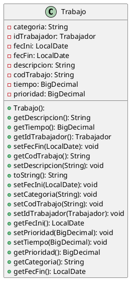

# Trabajo

**`BASE`**: /api/trabajos

## GET `BASE`

> Returns all the tasks in the database.  
> If there are no tasks, it will return an empty list.

<tabs>
    <tab title="Successful response">
        <code-block lang="json" collapsible="true" collapsed-title-line-number="2">
            {
              "result": [
                {
                  "codTrabajo": "J001",
                  "categoria": "Mecánica",
                  "descripcion": "Reparación de tuberías",
                  "fecIni": "2024-01-01",
                  "fecFin": null,
                  "tiempo": null,
                  "idTrabajador": null,
                  "prioridad": 2
                },
                {
                  "codTrabajo": "J002",
                  "categoria": "Fontanería",
                  "descripcion": "Reparación de tuberías",
                  "fecIni": "2022-01-02",
                  "fecFin": null,
                  "tiempo": 5.0,
                  "idTrabajador": {
                    "idTrabajador": "T002",
                    "dni": "23456789B",
                    "nombre": "Ana",
                    "apellidos": "Gómez",
                    "especialidad": "Fontanería",
                    "contraseña": "contraseña2",
                    "email": "ana.gomez@example.com"
                  },
                  "prioridad": 2
                },
                {
                  "codTrabajo": "J003",
                  "categoria": "Electricidad",
                  "descripcion": "Instalación de luces",
                  "fecIni": "2022-01-03",
                  "fecFin": null,
                  "tiempo": 8.0,
                  "idTrabajador": {
                    "idTrabajador": "T003",
                    "dni": "34567890C",
                    "nombre": "Carlos",
                    "apellidos": "Martínez",
                    "especialidad": "Electricidad",
                    "contraseña": "contraseña3",
                    "email": "carlos.martinez@example.com"
                  },
                  "prioridad": 3
                }
              ],
              "error": false
            }
        </code-block>
    </tab>
    <tab title="Empty list response">
        <code-block lang="json">
            {
              "result": [],
              "error": false
            }
        </code-block>
    </tab>
</tabs>

***

## GET `BASE`/:id

> Returns a task by its ID.  
> If the task does not exist, it will return an error message.

<tabs>
    <tab title="Successful response">
        <tip>
            /api/trabajos/J001
        </tip> 
         
        <code-block lang="json">
            {
              "result": {
                "codTrabajo": "J001",
                "categoria": "Mecánica",
                "descripcion": "Reparación de tuberías",
                "fecIni": "2024-01-01",
                "fecFin": null,
                "tiempo": null,
                "idTrabajador": null,
                "prioridad": 2
              },
              "error": false
            }
        </code-block>
    </tab>
    <tab title="Non-existent task response">
        <tip>
            /api/trabajos/J025
        </tip>
         
        <code-block lang="json">
            {
              "errorMessage": "El trabajo con ID 'J025' no existe en la base de datos",
              "error": true
            }
        </code-block>
    </tab>
</tabs>

***

## POST `BASE`

> Create a new task in the database and returns the task created.  
> If there are any errors, it will return an error message with the list of errors.  
> If the worker already exists, it will return an error message.
>
> All fields are required except:
> - fecFin: task completion date
> - tiempo: duration of the task
> - idTrabajador: worker assigned

<tabs>
    <tab title="Successful body">
        <code-block lang="json">
            {
              "codTrabajo": "J007",
              "categoria": "Pintura",
              "descripcion": "Pintar las paredes",
              "fecIni": "2024-01-09",
              "prioridad": 4
            }
        </code-block>
    </tab>
    <tab title="Response">
        <code-block lang="json">
            {
              "result": {
                "codTrabajo": "J007",
                "categoria": "Pintura",
                "descripcion": "Pintar las paredes",
                "fecIni": "2024-01-09",
                "fecFin": null,
                "tiempo": null,
                "idTrabajador": null,
                "prioridad": 4
              },
              "error": false
            }
        </code-block>
    </tab>
</tabs>

<tabs>
    <tab title="Other successful body">
        <code-block lang="json">
            {
              "codTrabajo": "J008",
              "categoria": "Pintura",
              "descripcion": "Pintar las paredes",
              "fecIni": "2024-01-09",
              "fecFin": "2024-01-11",
              "tiempo": 8.5,
              "idTrabajador": {
                "idTrabajador": "T001",
                "dni": "12345678A",
                "nombre": "Pepe",
                "apellidos": "Gomez",
                "especialidad": "Fontanería",
                "contraseña": "123",
                "email": "wefwefesadf.com"
              },
              "prioridad": 4
            }
        </code-block>
    </tab>
    <tab title="Response">
        <code-block lang="json">
            {
              "result": {
                "codTrabajo": "J008",
                "categoria": "Pintura",
                "descripcion": "Pintar las paredes",
                "fecIni": "2024-01-09",
                "fecFin": "2024-01-11",
                "tiempo": 8.5,
                "idTrabajador": {
                  "idTrabajador": "T001",
                  "dni": "12345678A",
                  "nombre": "Pepe",
                  "apellidos": "García",
                  "especialidad": "Fontaneria",
                  "contraseña": "123",
                  "email": "wefwefewf@ergerg.com"
                },
                "prioridad": 4
              },
              "error": false
            }
        </code-block>
    </tab>
</tabs>

<tabs>
    <tab title="Error body">
        <code-block lang="json">
            {
              "codTrabajo": "J009",
              "fecIni": "2024-01-09",
              "prioridad": 4
            }
        </code-block>
    </tab>
    <tab title="Response">
        <code-block lang="json">
            {
              "errorsList": [
                "La categoría no puede estar vacía",
                "La descripción no puede estar vacía"
              ],
              "error": true
            }
        </code-block>
    </tab>
</tabs>

<tabs>
    <tab title="Other error body">
        <code-block lang="json">
            {
              "codTrabajo": "J008",
              "categoria": "Pintura",
              "descripcion": "Pintar las paredes",
              "fecIni": "2024-01-09",
              "prioridad": 4
            }
        </code-block>
    </tab>
    <tab title="Response">
        <code-block lang="json">
            {
              "errorsList": [
                "El trabajo con id 'J008' ya existe en la base de datos"
              ],
              "error": true
            }
        </code-block>
    </tab>
</tabs>

***

## PUT `BASE`/:id

> Update a task by its ID and returns the task updated.  
> If the worker does not exist, it will return an error message.  
> If any of the fields are empty or invalid, it will return an error message with the list of errors.

<tabs>
    <tab title="Successful body">
        <tip>
            /api/trabajos/J007
            
We add an assigned worker

        </tip>
         
        <code-block lang="json">
            {
              "codTrabajo": "J007",
              "categoria": "Pintura",
              "descripcion": "Pintar las paredes",
              "fecIni": "2024-01-09",
              "prioridad": 4,
              "idTrabajador": {
                "idTrabajador": "T001",
                "dni": "12345678A",
                "nombre": "Pepe",
                "apellidos": "García",
                "especialidad": "Fontaneria",
                "contraseña": "123",
                "email": "wefwefewf@ergerg.com"
              }
            }
        </code-block>
    </tab>
    <tab title="Response">
        <code-block lang="json">
            {
              "result": {
                "codTrabajo": "J007",
                "categoria": "Pintura",
                "descripcion": "Pintar las paredes",
                "fecIni": "2024-01-09",
                "fecFin": null,
                "tiempo": null,
                "idTrabajador": {
                  "idTrabajador": "T001",
                  "dni": "12345678A",
                  "nombre": "Pepe",
                  "apellidos": "García",
                  "especialidad": "Fontaneria",
                  "contraseña": "123",
                  "email": "wefwefewf@ergerg.com"
                },
                "prioridad": 4
              },
              "error": false
            }
        </code-block>
    </tab>
</tabs>

<tabs>
    <tab title="Error body">
        <tip>
            /api/trabajos/J020
        </tip>
         
        <code-block lang="json">
            {
              "codTrabajo": "J020",
              "categoria": "Pintura",
              "descripcion": "Pintar las paredes",
              "fecIni": "2024-01-09",
              "prioridad": 4
            }
        </code-block>
    </tab>
    <tab title="Response">
        <code-block lang="json">
            {
              "errorsList": [
                "No se pudo editar, el trabajo con id 'J020' no existe en la base de datos"
              ],
              "error": true
            }
        </code-block>
    </tab>
</tabs>

***

## DELETE `BASE`/:id

> Delete a task by its ID. Returns a response without errors.  
> If the task does not exist, it will return an error message.

<tabs>
    <tab title="Successful response">
        <tip>
            /api/trabajos/J008
        </tip>
         
        <code-block lang="json">
            {
              "error": false
            }
        </code-block>
    </tab>
    <tab title="Non-existent task response">
        <tip>
            /api/trabajos/J020
        </tip>
         
        <code-block lang="json">
            {
              "errorMessage": "El trabajo con id 'J020' no existe en la base de datos",
              "error": true
            }
        </code-block>
    </tab>
</tabs>

***

## GET `BASE`/pendientes

> Returns all the tasks that are pending.
> If there are no pending tasks, it will return an empty list.

<tabs>
    <tab title="200 – Results">
        <code-block lang="json" collapsible="true" collapsed-title-line-number="2">
            {
              "result": [
                {
                  "codTrabajo": "J001",
                  "categoria": "Carpintería",
                  "descripcion": "Construcción de armario",
                  "fecIni": "2022-01-01",
                  "fecFin": null,
                  "tiempo": 10.0,
                  "idTrabajador": {
                    "idTrabajador": "T001",
                    "dni": "12345678A",
                    "nombre": "Juan",
                    "apellidos": "Pérez",
                    "especialidad": "Carpintería",
                    "contraseña": "contraseña1",
                    "email": "juan.perez@example.com"
                  },
                  "prioridad": 1
                },
                {
                  "codTrabajo": "J002",
                  "categoria": "Fontanería",
                  "descripcion": "Reparación de tuberías",
                  "fecIni": "2022-01-02",
                  "fecFin": null,
                  "tiempo": 5.0,
                  "idTrabajador": {
                    "idTrabajador": "T002",
                    "dni": "23456789B",
                    "nombre": "Ana",
                    "apellidos": "Gómez",
                    "especialidad": "Fontanería",
                    "contraseña": "contraseña2",
                    "email": "ana.gomez@example.com"
                  },
                  "prioridad": 2
                },
                {
                  "codTrabajo": "J003",
                  "categoria": "Electricidad",
                  "descripcion": "Instalación de luces",
                  "fecIni": "2022-01-03",
                  "fecFin": null,
                  "tiempo": 8.0,
                  "idTrabajador": {
                    "idTrabajador": "T003",
                    "dni": "34567890C",
                    "nombre": "Carlos",
                    "apellidos": "Martínez",
                    "especialidad": "Electricidad",
                    "contraseña": "contraseña3",
                    "email": "carlos.martinez@example.com"
                  },
                  "prioridad": 3
                },
                {
                  "codTrabajo": "J800",
                  "categoria": "Espacio-Tiempo",
                  "descripcion": "Visitar a Sarah Connor",
                  "fecIni": "2029-10-20",
                  "fecFin": null,
                  "tiempo": null,
                  "idTrabajador": null,
                  "prioridad": 1
                },
                {
                  "codTrabajo": "J004",
                  "categoria": "Electricidad",
                  "descripcion": "Desinstalación de luces",
                  "fecIni": "2022-01-03",
                  "fecFin": null,
                  "tiempo": null,
                  "idTrabajador": {
                    "idTrabajador": "T003",
                    "dni": "34567890C",
                    "nombre": "Carlos",
                    "apellidos": "Martínez",
                    "especialidad": "Electricidad",
                    "contraseña": "contraseña3",
                    "email": "carlos.martinez@example.com"
                  },
                  "prioridad": 4
                }
              ],
              "error": false
            }
        </code-block>
    </tab>
    <tab title="200 – Empty">
        <code-block lang="json">
            {
              "result": [],
              "error": false
            }
        </code-block>
    </tab>
</tabs>

## GET `BASE`/sinTrabajador

> Returns all the tasks that are pending and have no worker assigned.
> If there are no pending tasks without a worker assigned, it will return an empty list.

<tabs>
    <tab title="200 – Results">
        <code-block lang="json">
            {
              "result": [
                {
                  "codTrabajo": "J800",
                  "categoria": "Espacio-Tiempo",
                  "descripcion": "Visitar a Sarah Connor",
                  "fecIni": "2029-10-20",
                  "fecFin": null,
                  "tiempo": null,
                  "idTrabajador": null,
                  "prioridad": 1
                },
                {
                  "cod_trabajo": "J008",
                  "categoria": "Pintura",
                  "descripcion": "Pintar las paredes",
                  "fec_ini": "2024-01-09",
                  "fec_fin": null,
                  "tiempo": null,
                  "id_trabajador": null,
                  "prioridad": 4
                }
              ],
              "error": false
            }
        </code-block>
    </tab>
    <tab title="200 – Empty">
        <code-block lang="json">
            {
              "result": [],
              "error": false
            }
        </code-block>
    </tab>
</tabs>

## GET `BASE`/completados

> Accepts two optional query parameters: `fechaIni` and `fechaFin`
{style=note}

> Returns a list of all the completed tasks.  
> If there are no completed tasks, it will return an empty list.

<tabs>
    <tab title="200 – No param | Results">
        <tip>
            /api/trabajos/completados
        </tip>
         
        <code-block lang="json">
            {
              "result": [
                {
                  "codTrabajo": "J001",
                  "categoria": "Mantemimiento",
                  "descripcion": "Reparar aire acondicionado",
                  "fecIni": "1999-07-22",
                  "fecFin": "2030-10-20",
                  "tiempo": 120,
                  "idTrabajador": {
                    "idTrabajador": "T351",
                    "dni": "98986572M",
                    "nombre": "Alex",
                    "apellidos": "Cremento",
                    "especialidad": "Fontanería",
                    "contraseña": "Contraseña",
                    "email": "alex@cremento.com"
                  },
                  "prioridad": 2
                },
                {
                  "codTrabajo": "J025",
                  "categoria": "Limpieza",
                  "descripcion": "Limpiar los frenazos de los wateres",
                  "fecIni": "2022-05-25",
                  "fecFin": "2024-01-07",
                  "tiempo": 25,
                  "idTrabajador": {
                    "idTrabajador": T001",
                    "dni": "12312312A",
                    "nombre": "Dolores",
                    "apellidos": "Crotal",
                    "especialidad": "Limpieza",
                    "contraseña": "LaChachaMasVivaracha",
                    "email": "dolores@crotal.com"
                  },
                  "prioridad": 4
                },
                {
                  "codTrabajo": "J555",
                  "categoria": "Carpintería",
                  "descripcion": "Construir una cruz para mi amigo Yisus",
                  "fecIni": "0-12-24",
                  "fecFin": "2025-12-25",
                  "tiempo": 300,
                  "idTrabajador": {
                    "idTrabajador": "T001",
                    "dni": "12341234R",
                    "nombre": "Gepeto",
                    "apellidos": "ElDePinocho",
                    "especialidad": "Carpintería",
                    "contraseña": "IMRI",
                    "email": "condoscoj@clavos.com"
                  },
                  "prioridad": 2
                }
              ],
              "error": false
            }
        </code-block>
    </tab>
    <tab title="200 – No param | Empty">
        <tip>
            /api/trabajos/completados
        </tip>
         
        <code-block lang="json">
            {
              "result": [],
              "error": false
            }
        </code-block>
    </tab>
    <tab title="200 – FechaIni | Results">
        <tip>
            /api/trabajos/completados?fechaIni=1995-01-08
        </tip>
         
        <code-block lang="json">
            {
              "result": [
                {
                  "codTrabajo": "J001",
                  "categoria": "Mantemimiento",
                  "descripcion": "Reparar aire acondicionado",
                  "fecIni": "1999-07-22",
                  "fecFin": "2030-10-20",
                  "tiempo": 120,
                  "idTrabajador": {
                    "idTrabajador": "T351",
                    "dni": "98986572M",
                    "nombre": "Alex",
                    "apellidos": "Cremento",
                    "especialidad": "Fontanería",
                    "contraseña": "Contraseña",
                    "email": "alex@cremento.com"
                  },
                  "prioridad": 2
                },
                {
                  "codTrabajo": "J025",
                  "categoria": "Limpieza",
                  "descripcion": "Limpiar los frenazos de los wateres",
                  "fecIni": "2022-05-25",
                  "fecFin": "2024-01-07",
                  "tiempo": 25,
                  "idTrabajador": {
                    "idTrabajador": T001",
                    "dni": "12312312A",
                    "nombre": "Dolores",
                    "apellidos": "Crotal",
                    "especialidad": "Limpieza",
                    "contraseña": "LaChachaMasVivaracha",
                    "email": "dolores@crotal.com"
                  },
                  "prioridad": 4
                },
              ],
              "error": false
            }
        </code-block>
    </tab>
    <tab title="200 – FechaFin | Results">
        <tip>
            /api/trabajos/completados?fechaFin=2027-09-15
        </tip>
         
        <code-block lang="json">
            {
              "result": [
                {
                  "codTrabajo": "J025",
                  "categoria": "Limpieza",
                  "descripcion": "Limpiar los frenazos de los wateres",
                  "fecIni": "2022-05-25",
                  "fecFin": "2024-01-07",
                  "tiempo": 25,
                  "idTrabajador": {
                    "idTrabajador": T001",
                    "dni": "12312312A",
                    "nombre": "Dolores",
                    "apellidos": "Crotal",
                    "especialidad": "Limpieza",
                    "contraseña": "LaChachaMasVivaracha",
                    "email": "dolores@crotal.com"
                  },
                  "prioridad": 4
                },
                {
                  "codTrabajo": "J555",
                  "categoria": "Carpintería",
                  "descripcion": "Construir una cruz para mi amigo Yisus",
                  "fecIni": "0-12-24",
                  "fecFin": "2025-12-25",
                  "tiempo": 300,
                  "idTrabajador": {
                    "idTrabajador": "T001",
                    "dni": "12341234R",
                    "nombre": "Gepeto",
                    "apellidos": "ElDePinocho",
                    "especialidad": "Carpintería",
                    "contraseña": "IMRI",
                    "email": "condoscoj@clavos.com"
                  },
                  "prioridad": 2
                }
              ],
              "error": false
            }
        </code-block>
    </tab>
    <tab title="200 – FechaIni + FechaFin | Results">
        <tip>
            /api/trabajos/completados?fechaIni=2020-01-01&fechaFin=2024-12-31
        </tip>
         
        <code-block lang="json">
            {
              "result": [
                {
                  "codTrabajo": "J025",
                  "categoria": "Limpieza",
                  "descripcion": "Limpiar los frenazos de los wateres",
                  "fecIni": "2022-05-25",
                  "fecFin": "2024-01-07",
                  "tiempo": 25,
                  "idTrabajador": {
                    "idTrabajador": T001",
                    "dni": "12312312A",
                    "nombre": "Dolores",
                    "apellidos": "Crotal",
                    "especialidad": "Limpieza",
                    "contraseña": "LaChachaMasVivaracha",
                    "email": "dolores@crotal.com"
                  },
                  "prioridad": 4
                },
              ],
              "error": false
            }
        </code-block>
    </tab>
</tabs>

## GET `BASE`/:id/trabajador

> This endpoint is not necessary since the worker is already included in the task object, but
> it doesn't hurt anyone.{style=warning}

> Returns the worker assigned to a task by its ID.  
> If the task doesn't have a worker assigned, it will return an error message.
> If the task does not exist, it will return an error message.

<tabs>
    <tab title="200 – Result">
        <code-block lang="json">
            {
              "result": {
                "idTrabajador": "T800",
                "dni": "80080080T",
                "nombre": "Arnaldo",
                "apellidos": "Charcheneguer",
                "especialidad": "Espacio-Tiempo",
                "contraseña": "Dame tu ropa",
                "email": "sayonara@volvere.com"
              },
              "error": false
            }
        </code-block>
    </tab>
    <tab title="404 – Not Found">
        <code-block lang="json">
            {
              "errorMessage": "El trabajo con ID 'J800' no tiene un trabajador asignado",
              "error": false
            }
        </code-block>
    </tab>
</tabs>

## PUT `BASE`/asignar/:codTrabajo/:idTrabajador

> Assigns a worker to a task by their IDs.  
> If the task does not exist, it will return an error message.
> If the worker does not exist, it will return an error message.
> If the task already has a worker assigned, it will return an error message.

<tabs>
    <tab title="200 – Success">
        <tip>
            
/api/trabajos/asignar/J800/T800

        </tip>
         
        <code-block lang="json">
            {
              "errorMessage": {
                "codTrabajo": "J800",
                "categoria": "Espacio-Tiempo",
                "descripcion": "Visitar a Sarah Connor",
                "fecIni": "2029-10-20",
                "fecFin": null,
                "tiempo": null,
                "idTrabajador": {
                  "idTrabajador": "T800",
                  "dni": "80080080T",
                  "nombre": "Arnaldo",
                  "apellidos": "Charcheneguer",
                  "especialidad": "Espacio-Tiempo",
                  "contraseña": "Dame tu ropa",
                  "email": "sayonara@volvere.com"
                },
                "prioridad": 1
              },
              "error": false
            }
        </code-block>
    </tab>
    <tab title="404 – Task Not Found">
        <warning>
            
/api/trabajos/asignar/J8000/T8000

        </warning>
         
        <code-block lang="json">
            {
              "errorMessage": "Trabajo no encontrado",
              "error": true
            }
        </code-block>
    </tab>
    <tab title="404 – Worker Not Found">
        <warning>
            
/api/trabajos/asignar/J800/T8000

        </warning>
         
        <code-block lang="json">
            {
              "errorMessage": "Trabajador no encontrado",
              "error": true
            }
        </code-block>
    </tab>
    <tab title="400 – Worker already assigned">
        <warning>
            
/api/trabajos/asignar/J001/T800

        </warning>
         
        <code-block lang="json">
            {
              "errorMessage": "El trabajo ya tiene un trabajador asignado",
              "error": true
            }
        </code-block>
    </tab>
</tabs>

## PUT `BASE`/finalizar/:id

> Accepts from 1 to 3 parameters:
> - id (@PathVariable) (required): task ID
> > Mandatory parameter.
> > {style=warning}
> - fec_fin (@RequestParam) (not required): task completion date
> - tiempo (@RequestParam) (not required): duration of the task
> 
{style=note}

> Marks a task as completed by setting the completion date and the duration of the task.
> Checks if the task exists.
> Checks if the task has a worker assigned.
> Checks that `tiempo` is not greater than 8 hours per day.
> Checks that `fec_fin` is not before `fecIni`.
> Checks that `fec_fin` is not after the current date.
> If fec_fin is not provided, it will set the current date.
> If tiempo is not provided, it will set the duration to 8 hours per day (not the best algorithm, 
> as no one works 8 hours every day).
> If the task is already completed, just updates following the same rules mentioned above.

<tabs>
    <tab title="200 – No parameters">
        <tip>
            
/api/trabajos/finalizar/J8

        </tip>
         
        <code-block lang="json">
            {
              "result": {
                "codTrabajo": "J8",
                "categoria": "Carpintería",
                "descripcion": "Lijar maderos",
                "fecIni": "2024-01-09",
                "fecFin": "2024-05-15",
                "tiempo": 48,
                "idTrabajador": {
                  "idTrabajador": "T001",
                  "dni": "12345678A",
                  "nombre": "Juan",
                  "apellidos": "Pérez",
                  "especialidad": "Carpintería",
                  "contraseña": "contraseña1",
                  "email": "juan.perez@example.com"
                },
                "prioridad": 4
              },
              "error": false
            }
        </code-block>
    </tab>
    <tab title="200 – Same date as start date, no time">
        <tip>
            
/api/trabajos/finalizar/J8?fec_fin=2024-01-09

        </tip>
         
        <code-block lang="json">
            {
              "result": {
                "codTrabajo": "J8",
                "categoria": "Carpintería",
                "descripcion": "Lijar maderos",
                "fecIni": "2024-01-09",
                "fecFin": "2024-01-09",
                "tiempo": 8,
                "idTrabajador": {
                  "idTrabajador": "T001",
                  "dni": "12345678A",
                  "nombre": "Juan",
                  "apellidos": "Pérez",
                  "especialidad": "Carpintería",
                  "contraseña": "contraseña1",
                  "email": "juan.perez@example.com"
                },
                "prioridad": 4
              },
              "error": false
            }
        </code-block>
    </tab>
    <tab title="200 – Next day, no time">
        <tip>
            
/api/trabajos/finalizar/J8?fec_fin=2024-01-10

        </tip>
         
        <code-block lang="json">
            {
              "result": {
                "codTrabajo": "J8",
                "categoria": "Carpintería",
                "descripcion": "Lijar maderos",
                "fecIni": "2024-01-09",
                "fecFin": "2024-01-10",
                "tiempo": 8,
                "idTrabajador": {
                  "idTrabajador": "T001",
                  "dni": "12345678A",
                  "nombre": "Juan",
                  "apellidos": "Pérez",
                  "especialidad": "Carpintería",
                  "contraseña": "contraseña1",
                  "email": "juan.perez@example.com"
                },
                "prioridad": 4
              },
              "error": false
            }
        </code-block>
    </tab>
    <tab title="200 – No day, acceptable time">
        <tip>
            
/api/trabajos/finalizar/J8?tiempo=10

        </tip>
         
        <code-block lang="json">
            {
              "result": {
                "codTrabajo": "J8",
                "categoria": "Carpintería",
                "descripcion": "Lijar maderos",
                "fecIni": "2024-01-09",
                "fecFin": "2024-05-15",
                "tiempo": 10,
                "idTrabajador": {
                  "idTrabajador": "T001",
                  "dni": "12345678A",
                  "nombre": "Juan",
                  "apellidos": "Pérez",
                  "especialidad": "Carpintería",
                  "contraseña": "contraseña1",
                  "email": "juan.perez@example.com"
                },
                "prioridad": 4
              },
              "error": false
            }
        </code-block>
    </tab>
    <tab title="400 – Acceptable day, unacceptable time">
        <tip>
            
/api/trabajos/finalizar/J8?fec_fin=2024-01-10&tiempo=10

        </tip>
         
        <code-block lang="json">
            {
              "errorMessage": "El tiempo no puede ser mayor a 8 horas por día trabajado",
              "error": true
            }
        </code-block>
    </tab>
    <tab title="404 – Not Found">
        <warning>
            
/api/trabajos/finalizar/J009

        </warning>
         
        <code-block lang="json">
            {
              "errorMessage": "Trabajo no encontrado",
              "error": true
            }
        </code-block>
    </tab>
    <tab title="400 – Worker not assigned">
        <warning>
            
/api/trabajos/finalizar/J008

        </warning>
         
        <code-block lang="json">
            {
              "errorMessage": "El trabajo no tiene un trabajador asignado",
              "error": true
            }
        </code-block>
    </tab>
    <tab title="400 – Date before start date">
        <warning>
            
/api/trabajos/finalizar/J8?fec_fin=2024-01-04

        </warning>
         
        <code-block lang="json">
            {
              "errorMessage": "La fecha de finalización no puede ser menor a la fecha de inicio",
              "error": true
            }
        </code-block>
    </tab>
    <tab title="400 – Date after current date">
        <warning>
            
/api/trabajos/finalizar/J8?fec_fin=2094-01-10

        </warning>
         
        <code-block lang="json">
            {
              "errorMessage": "La fecha de finalización no puede ser mayor a la fecha actual",
              "error": true
            }
        </code-block>
    </tab>
    <tab title="400 – More than 8h/day">
        <warning>
            
/api/trabajos/finalizar/J8?fec_fin=2024-01-10&tiempo=200

        </warning>
         
        <code-block lang="json">
            {
              "errorMessage": "El tiempo no puede ser mayor a 8 horas por día trabajado",
              "error": true
            }
        </code-block>
    </tab>
    <tab title="400 – Negative time">
        <warning>
            
/api/trabajos/finalizar/J8?fec_fin=2024-01-10&tiempo=-2

        </warning>
         
        <code-block lang="json">
            {
              "errorMessage": "El tiempo no puede ser menor a 0",
              "error": true
            }
        </code-block>
    </tab>
</tabs>

## PUT `BASE`/editarFechaFin/:id

> This endpoint is necessary, as simple PUT `BASE`/:id does not check anything, and 
> PUT `BASE`/finalizar/:id will calculate `tiempo` when it's not provided. {style=warning}

> Same as PUT `BASE`/finalizar/:id but only for the completion date.

<tabs>
    <tab title="200 – Acceptable date">
        <tip>
            
/api/trabajos/editarFechaFin/J8?fec_fin=2024-01-10

        </tip>
         
        <code-block lang="json">
            {
              "result": {
                "codTrabajo": "J8",
                "categoria": "Carpintería",
                "descripcion": "Lijar maderos",
                "fecIni": "2024-01-09",
                "fecFin": "2024-01-10",
                "tiempo": 2.0,
                "idTrabajador": {
                  "idTrabajador": "T001",
                  "dni": "12345678A",
                  "nombre": "Juan",
                  "apellidos": "Pérez",
                  "especialidad": "Carpintería",
                  "contraseña": "contraseña1",
                  "email": "juan.perez@example.com"
                },
                "prioridad": 4
              },
              "error": false
            }
        </code-block>
    </tab>
    <tab title="200 – No parameter">
        <tip>
            
/api/trabajos/editarFechaFin/J8

        </tip>
         
        <code-block lang="json">
            {
              "result": {
                "codTrabajo": "J8",
                "categoria": "Carpintería",
                "descripcion": "Lijar maderos",
                "fecIni": "2024-01-09",
                "fecFin": "2024-05-15",
                "tiempo": 2.0,
                "idTrabajador": {
                  "idTrabajador": "T001",
                  "dni": "12345678A",
                  "nombre": "Juan",
                  "apellidos": "Pérez",
                  "especialidad": "Carpintería",
                  "contraseña": "contraseña1",
                  "email": "juan.perez@example.com"
                },
                "prioridad": 4
              },
              "error": false
            }
        </code-block>
    </tab>
    <tab title="400 – Date before start date">
        <tip>
            
/api/trabajos/editarFechaFin/J8?fec_fin=2024-01-05

        </tip>
         
        <code-block lang="json">
            {
              "errorMessage": "La fecha de finalización no puede ser menor a la fecha de inicio",
              "error": true
            }
        </code-block>
    </tab>
    <tab title="400 – Date after current date">
        <warning>
            
/api/trabajos/editarFechaFin/J8?fec_fin=2094-01-10

        </warning>
         
        <code-block lang="json">
            {
              "errorMessage": "La fecha de finalización no puede ser mayor a la fecha actual",
              "error": true
            }
        </code-block>
    </tab>
</tabs>

## PUT `BASE`/editarTiempo/:id

> This endpoint is necessary, as simple PUT `BASE`/:id does not check anything, and
> PUT `BASE`/finalizar/:id will assume today's date when `fec_fin` is not provided. {style=warning}

> Same as PUT `BASE`/finalizar/:id but only for the duration of the task.
> Also checks that `fec_fin` is not null

<tabs>
    <tab title="200 – Acceptable time">
        <tip>
            
/api/trabajos/editarTiempo/J8?tiempo=4

        </tip>
         
        <code-block lang="json">
            {
              "result": {
                "codTrabajo": "J8",
                "categoria": "Carpintería",
                "descripcion": "Lijar maderos",
                "fecIni": "2024-01-09",
                "fecFin": "2024-01-10",
                "tiempo": 4.0,
                "idTrabajador": {
                  "idTrabajador": "T001",
                  "dni": "12345678A",
                  "nombre": "Juan",
                  "apellidos": "Pérez",
                  "especialidad": "Carpintería",
                  "contraseña": "contraseña1",
                  "email": "juan.perez@example.com"
                },
                "prioridad": 4
              },
              "error": false
            }
        </code-block>
    </tab>
    <tab title="200 – No parameter">
        <tip>
            
/api/trabajos/editarTiempo/J8

        </tip>
         
        <code-block lang="json">
            {
              "result": {
                "codTrabajo": "J8",
                "categoria": "Carpintería",
                "descripcion": "Lijar maderos",
                "fecIni": "2024-01-09",
                "fecFin": "2024-05-15",
                "tiempo": 48.0,
                "idTrabajador": {
                  "idTrabajador": "T001",
                  "dni": "12345678A",
                  "nombre": "Juan",
                  "apellidos": "Pérez",
                  "especialidad": "Carpintería",
                  "contraseña": "contraseña1",
                  "email": "juan.perez@example.com"
                },
                "prioridad": 4
              },
              "error": false
            }
        </code-block>
    </tab>
    <tab title="400 – Date before start date">
        <tip>
            
/api/trabajos/editarTiempo/J8?fec_fin=2024-01-05

        </tip>
         
        <code-block lang="json">
            {
              "errorMessage": "La fecha de finalización no puede ser menor a la fecha de inicio",
              "error": true
            }
        </code-block>
    </tab>
    <tab title="400 – Date after current date">
        <warning>
            
/api/trabajos/editarTiempo/J8?fec_fin=2094-01-10

        </warning>
         
        <code-block lang="json">
            {
              "errorMessage": "La fecha de finalización no puede ser mayor a la fecha actual",
              "error": true
            }
        </code-block>
    </tab>
    <tab title="400 – Null date">
        <warning>
            
/api/trabajos/editarFechaFin/J8?tiempo=3

            
Assuming fec_fin is null

        </warning>
         
        <code-block lang="json">
            {
              "errorMessage": "El trabajo no tiene una fecha de finalización asignada",
              "error": true
            }
        </code-block>
    </tab>
</tabs>

